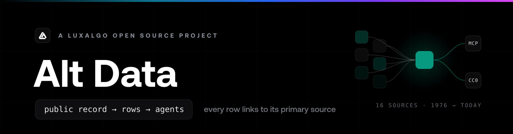

<div align="center">



**The public record, as infrastructure.**

What Congress trades, what insiders file, who wins federal contracts, what the Fed said:
LuxAlgo Market Trackers turns the public record of US markets into one clean dataset you can query,
subscribe to, or hand to an AI agent. Every row links back to the government document it came
from.

[](https://github.com/LuxAlgo/market-trackers/actions/workflows/ci.yml)
[](LICENSE)
[](data-licenses/DATA-LICENSE)
[](#principles)

LuxAlgo Market Trackers is a LuxAlgo open-source project. The official repository is
[github.com/LuxAlgo/market-trackers](https://github.com/LuxAlgo/market-trackers), and the published data lives
at [github.com/LuxAlgo/market-trackers-data](https://github.com/LuxAlgo/market-trackers-data).

</div>

---

LuxAlgo Market Trackers ingests 18 datasets from **primary sources only**, normalizes them into one
schema, stores them in a local database, serves them to AI agents over **MCP**, and republishes
everything as **free daily data dumps**. Every row carries provenance: a working deep link to
the primary document it was parsed from. No accounts, no telemetry, and every source is keyless
except patents (a free USPTO Open Data Portal key).

## Quickstart

The only identity LuxAlgo Market Trackers ever sends is a contact email inside the User-Agent that the
SEC's fair-access policy requires for EDGAR.

```bash
git clone https://github.com/LuxAlgo/market-trackers && cd market-trackers
pnpm install && pnpm build
alias market-trackers="node packages/cli/dist/index.js"

# 1. Pull data. Short-sale volume needs nothing at all:
market-trackers sync --source finra

# 2. Insider filings need the SEC-required contact email:
market-trackers sync --source edgar --contact you@example.com --limit 500

# 3. See what you have:
market-trackers status

# 4. Serve it to your AI agent over MCP:
market-trackers serve
```

The same commands ship on npm as `npx @luxalgo/market-trackers-cli …` when you'd rather not hold a
checkout.

Or skip ingestion entirely: the published dumps are a rebuildable archive, and `market-trackers import`
is the exact mirror image of `market-trackers export`:

```bash
git clone https://github.com/LuxAlgo/market-trackers-data
market-trackers import ./market-trackers-data
```

Everything is incremental and idempotent: `market-trackers sync` picks up where it left off (per-source
watermarks) and re-running never duplicates a row (natural-key upserts). SQLite by default;
`--db postgres://…` is the same store behind one flag.

## Datasets

| Dataset                             | Primary source                                 | What you get                                                                       | Status in this build    |
| ----------------------------------- | ---------------------------------------------- | ---------------------------------------------------------------------------------- | ----------------------- |
| **Congress trades**                 | Senate eFD + House Clerk financial disclosures | Every reported transaction, amounts as disclosed ranges, member identities         | ✅ ingesting            |
| **Insider transactions**            | SEC EDGAR Forms 3/4/5 (XML + quarterly sets)   | Every insider transaction and holding row, raw SEC codes + legend                  | ✅ ingesting            |
| **13F holdings**                    | SEC EDGAR 13F-HR information tables            | Quarterly institutional holdings, CUSIP-keyed, values normalized to dollars        | ✅ ingesting            |
| **Government contracts**            | USAspending API                                | Federal contract awards with best-effort recipient→ticker mapping                  | ✅ ingesting            |
| **Government grants**               | USAspending API                                | Federal grant awards, through the same conservative recipient→ticker mapping       | ✅ ingesting            |
| **Lobbying**                        | Senate LDA API                                 | Lobbying filings with client→ticker mapping                                        | ✅ ingesting            |
| **Short-sale volume**               | FINRA Reg SHO daily files                      | Symbol-day short volume + short ratio, both pre- and post-2026 file formats        | ✅ ingesting            |
| **Committee assignments**           | unitedstates/congress-legislators              | Which member sits on which committee, the "oversees what they trade" join          | ✅ ingesting            |
| **Patents**                         | PatentsView bulk data (USPTO Open Data Portal) | Granted patents by assignee, joined to tickers                                     | ✅ ingesting (free key) |
| **Clinical trials**                 | ClinicalTrials.gov API v2                      | Study registrations and status by sponsor, joined to tickers                       | ✅ ingesting            |
| **FDA drug approvals**              | openFDA (Drugs@FDA)                            | Approval actions as the FDA recorded them: history, never a prediction             | ✅ ingesting            |
| **Futures positioning (COT)**       | CFTC Commitments of Traders                    | Weekly legacy-report positioning per market                                        | ✅ ingesting            |
| **Federal legislation**             | GPO GovInfo bulk BILLSTATUS                    | Bill titles, sponsors, latest actions, joined to who lobbies on each bill          | ✅ ingesting            |
| **Campaign finance: totals**        | FEC bulk downloads                             | Candidate-cycle receipts/disbursements/cash, verbatim FEC numbers                  | ✅ ingesting            |
| **Campaign finance: PAC→candidate** | FEC bulk downloads                             | Committee→candidate contributions as filed (refunds stay negative)                 | ✅ ingesting            |
| **Congressional hearings**          | GPO GovInfo CHRG (sitemaps + MODS)             | Hearing transcripts indexed: title, committees, witnesses, member ids, deep links  | ✅ ingesting            |
| **Fed communications**              | Federal Reserve Board public JSON feeds        | FOMC statements/minutes announcements, speeches, testimony, as an index with links | ✅ ingesting            |
| **Wikipedia pageviews**             | Wikimedia REST pageviews API                   | Daily article views for a curated public-company map: attention, measured          | ✅ ingesting            |

`market-trackers status` always tells you exactly what your build ingests; sources that aren't implemented
yet say so out loud instead of pretending.

## Ask your agent, get receipts

`market-trackers-mcp` serves the whole store to any MCP client, locally over stdio or hosted over
stateless streamable HTTP. Every answer carries primary-source citations: when an agent tells you
what Congress bought this week, it can show you the actual filings.

```jsonc
// Claude Desktop / Claude Code / any MCP client
{
  "mcpServers": {
    "market-trackers": {
      "command": "npx",
      "args": ["-y", "@luxalgo/market-trackers-mcp"],
      "env": { "MARKET_TRACKERS_DB": "/path/to/market-trackers.db" },
    },
  },
}
```

| Tool                          | What it answers                                                               |
| ----------------------------- | ----------------------------------------------------------------------------- |
| `tracker_congress_trades`     | "What did Congress buy this week?", with per-filing citations                 |
| `tracker_congress_members`    | Resolve member names; who trades most                                         |
| `tracker_member_profile`      | One member's whole public footprint: trades, committees, top tickers          |
| `tracker_committees`          | Committee rosters: who sits where, joined to what they trade                  |
| `tracker_insider_trades`      | Form 3/4/5 rows by ticker/insider/code/value, with the SEC code legend        |
| `tracker_insider_summary`     | Buys vs sells, net shares, notable insiders for a ticker (arithmetic only)    |
| `tracker_13f_holders`         | Who holds a security, with share changes vs the prior quarter                 |
| `tracker_13f_manager`         | One manager's holdings ("what does Berkshire hold?")                          |
| `tracker_gov_contracts`       | Federal contract awards by ticker/recipient/agency                            |
| `tracker_gov_grants`          | Federal grant awards by ticker/recipient/agency                               |
| `tracker_gov_contract_totals` | Government revenue over time: award counts + sums per year/quarter            |
| `tracker_lobbying`            | Lobbying filings by ticker/client/registrant                                  |
| `tracker_short_volume`        | Daily short-sale volume series for a ticker                                   |
| `tracker_patents`             | Granted patents by ticker/assignee                                            |
| `tracker_clinical_trials`     | Studies by ticker/sponsor/status/phase                                        |
| `tracker_fda_approvals`       | Drugs@FDA approval actions by ticker/company/drug                             |
| `tracker_cot`                 | Weekly futures positioning series for a market                                |
| `tracker_bills`               | Bill status by title/sponsor/policy area, plus who lobbies on that bill       |
| `tracker_campaign_finance`    | Candidate money: FEC totals + itemized committee→candidate contributions      |
| `tracker_congress_hearings`   | Hearing transcripts by committee/witness/chamber: "who testified about X?"    |
| `tracker_fed_communications`  | FOMC statements, minutes, speeches, testimony: what the Fed published, linked |
| `tracker_wiki_pageviews`      | Wikipedia attention series for a company, by ticker or article                |
| `tracker_search`              | One query across tickers, members, managers, insiders                         |
| `tracker_freshness`           | How old every dataset is, so agents can check before they answer              |

`tracker_freshness` is first-class on purpose: an agent quoting stale congress data without knowing
it is the failure mode that kills trust. And the committee tools exist because the most-asked
question about congressional trading, "do they trade what they oversee?", is a **join**, not a
score: LuxAlgo Market Trackers gives you both sides of it with receipts and leaves the conclusion to you.

## The dumps

`market-trackers export` writes the full store as versioned JSON: daily deltas per dataset, full snapshots
sharded by event year, an RSS feed per dataset, and a manifest with row counts, watermarks, and
per-source health. A scheduled CI workflow publishes them to a public data repository
([`LuxAlgo/market-trackers-data`](https://github.com/LuxAlgo/market-trackers-data)) so analysts and journalists who
will never run code still get the data: one URL, no signup.

```
congress/trades/2026/2026-08-24.json      # daily delta: what was ingested that day
congress/trades/latest.json               # newest delta, stable URL
congress/trades/feed.xml                  # RSS 2.0 over the newest rows
congress/trades/feeds/by-member/P000197.xml   # per-member feed: follow ONE member
congress/trades/feeds/by-ticker/NVDA.xml      # per-ticker feed: follow ONE stock
congress/trades/snapshot-2026.json.gz     # full history, sharded by event year
congress/trades/snapshot-2026.parquet     # …with a Parquet sibling for columnar tooling
manifest.json                             # row counts, freshness, source health
explorer/index.html                       # zero-build data browser (works on GitHub Pages)
```

The two most time-sensitive datasets (congress trades, insider transactions) also get an intraday
fast lane that tops up their deltas between daily publishes, and a weekly workflow mirrors the
whole data repo to a Hugging Face dataset for `datasets.load_dataset(...)` consumers. The full
contract is in [`docs/market-trackers-data.md`](docs/market-trackers-data.md).

Code is MIT; **the dumps are CC0**: public-domain-derived government data stays public domain.
See [`data-licenses/`](data-licenses/).

## Alerts without a server

Every dataset directory carries a `feed.xml`: plain RSS 2.0 over the newest ingested rows, each
item a strictly factual one-line restatement of a row whose link goes straight to the
primary-source document. Point a feed reader, a chat integration, or a five-line script at one
URL and you have congress-trade alerts with receipts. No server, no webhooks, no account,
nothing to deploy.

It's also per-entity: `feeds/by-ticker/{TICKER}.xml` under every ticker-bearing dataset, and
`feeds/by-member/{bioguideId}.xml` under congress trades. One URL follows one stock's insider
filings, or one member's disclosures, and nothing else. Feeds exist for entities active in the
last 30 days (capped at the 200 most active per dataset; the manifest carries the exact counts,
so the cap is never silent).

## Deep history

`market-trackers backfill --source edgar --from 2004-01-01` walks a source as far back as its free history
goes: chunked, resumable, watermark-driven, so an interrupted run picks up exactly where it
stopped instead of re-walking covered ground. The `backfill.yml` workflow runs the same engine on
CI and publishes the resulting year-sharded snapshots as release assets on the data repo, so
nobody has to re-crawl a decade of filings that CI already crawled. And because `market-trackers import`
rebuilds a store from published dumps, the archive is not a pile of downloads; it's a restorable
database. Per-source depth notes: [`docs/backfill.md`](docs/backfill.md).

## Bring your own prices

`market-trackers analyze congress --prices your-prices.csv` joins disclosed trades against a price series
**you supply** (`date,ticker,close`) and reports the price change over a window after each
disclosure: the classic "what happened after they filed?" table. LuxAlgo Market Trackers ships no market
data and computes no scores; the output is arithmetic between public records and your own inputs,
every result carries a disclaimer saying exactly that, disclosed amounts stay ranges, and the
timeline anchors on the **filing** date, because that's when the public actually learned.

`market-trackers backtest congress --prices your-prices.csv --member <name> --window 30` goes one step
further: one fixed, fully disclosed strategy (enter at the first close after the disclosure,
exit after the window, equal weight per event) with win rate, mean/median change, and every
skipped event kept in the output with its reason. No parameter fitting, no optimization, no
costs modeled, and disclosed amount ranges are never used as position sizes. The point is an
honest baseline you can reproduce, not a pitch. Details: [`docs/analytics.md`](docs/analytics.md).

## On a chart

The rows chart well, and the hosted trackers show how: the
[insider tracker on LuxAlgo](https://www.luxalgo.com/markets/insider-tracker) paints every Form 4
fill onto the ticker's price tape with [Vela](https://github.com/LuxAlgo/Vela), LuxAlgo's
open-source charting engine (`@luxalgo/vela`, Apache-2.0), as a custom renderer layer: the same
`tracker_insider_trades` rows this repo serves, each marker still linking to its filing. That
happens in the visitor's browser. Nothing here draws or serves a chart, and the price bars come
from the page's own market-data source, never from LuxAlgo Market Trackers, which ships no market
data by design. To do the same with your own store, take the rows from the MCP tools or the dumps,
supply bars via Vela's `data` option or a provider, and paint the markers through
[Vela's plugin SDK](https://github.com/LuxAlgo/Vela/blob/main/docs/contributing/plugin-sdk.md).

## Python

The dumps are plain JSON with Parquet siblings, so nothing about LuxAlgo Market Trackers requires
JavaScript. The dependency-light reader in [`python/`](python/) (pandas optional) loads them from
a URL or a checkout:

```python
from market_trackers_data import load_snapshot, to_dataframe

rows = load_snapshot("https://raw.githubusercontent.com/LuxAlgo/market-trackers-data/main", "congress-trades")
df = to_dataframe(rows)  # plain list[dict] if pandas isn't installed
```

Worked, reproducible examples live in [`notebooks/`](notebooks/): price change after disclosure
(bring-your-own-prices) and the committee-oversight join.

## Data health

Honesty is the point: pipelines rot, formats drift, and a data project that can't show you its
health isn't one you should trust. Daily canaries fetch each source, assert parse success rates,
and fingerprint page/file formats so drift turns the board red _before_ a parser silently
misparses. This board is generated from the latest canary run:

<!-- HEALTH-BOARD:START -->

| Source                           | Status     | Last checked             |
| -------------------------------- | ---------- | ------------------------ |
| SEC EDGAR (Forms 3/4/5, 13F-HR)  | 🟢 healthy | 2026-09-04T15:22:57.336Z |
| edgar-bulk                       | 🟢 healthy | 2026-09-04T15:22:57.665Z |
| Senate eFD (PTRs)                | 🟢 healthy | 2026-09-04T15:22:59.834Z |
| House Clerk (PTRs)               | 🟢 healthy | 2026-09-04T15:23:00.097Z |
| USAspending (contracts + grants) | 🟢 healthy | 2026-09-04T15:23:00.798Z |
| Senate LDA                       | 🟢 healthy | 2026-09-04T15:23:01.746Z |
| FINRA Reg SHO                    | 🟢 healthy | 2026-09-04T15:23:02.046Z |
| Committee assignments            | 🟢 healthy | 2026-09-04T15:23:02.459Z |
| PatentsView (patents)            | 🟢 healthy | 2026-09-04T15:23:02.620Z |
| ClinicalTrials.gov               | 🟢 healthy | 2026-09-04T15:23:02.663Z |
| openFDA (Drugs@FDA)              | 🟢 healthy | 2026-09-04T15:23:03.210Z |
| CFTC COT                         | 🟡 stale   | 2026-09-04T15:23:03.466Z |
| Wikimedia pageviews              | 🟢 healthy | 2026-09-04T15:23:03.551Z |
| GovInfo (bill status)            | 🟢 healthy | 2026-09-04T15:23:06.999Z |
| FEC campaign finance             | 🟢 healthy | 2026-09-04T15:23:08.553Z |
| GovInfo CHRG (hearings)          | 🟢 healthy | 2026-09-04T15:23:08.593Z |
| Federal Reserve (communications) | 🟢 healthy | 2026-09-04T15:23:08.701Z |

<!-- HEALTH-BOARD:END -->

## Principles

- **MIT code, CC0 data.** The public record belongs to the public, including in machine-readable
  form.
- **Primary sources only.** SEC EDGAR, Senate eFD, the House Clerk, USAspending, the Senate LDA
  API, FINRA, the unitedstates/congress-legislators project, PatentsView bulk data via the
  USPTO Open Data Portal, ClinicalTrials.gov,
  openFDA, the CFTC, GPO GovInfo (bills and the CHRG hearings collection), the FEC, the Federal
  Reserve Board's public feeds, and the Wikimedia pageviews API. Never scraped from
  commercial products.
- **Receipts everywhere.** Every row carries `provenance`: the primary-source URL, retrieval time,
  parser identity, and a confidence tier. Rows extracted from scanned documents are flagged
  `needsReview` instead of silently trusted.
- **No telemetry.** LuxAlgo Market Trackers never phones home. The only outbound identity is the
  SEC-required contact email in the EDGAR User-Agent, and it goes to the SEC, nobody else.
- **Fair access, enforced in code.** The EDGAR client is hard-capped at 10 requests/second by a
  rate limiter with a unit test, not by a sentence in a README.

## Non-goals

Things LuxAlgo Market Trackers deliberately does not do:

- **No predictions, signals, scores, or "conviction" ratings.** LuxAlgo Market Trackers is data with receipts, not
  advice. `shortRatio`, buy/sell counts, and `market-trackers analyze`'s price changes are arithmetic, not
  recommendations.
- **No fabricated precision.** Congressional amounts are disclosed as ranges; LuxAlgo Market Trackers stores the
  range bounds and never invents midpoints, not even in analytics output.
- **No social/Reddit sentiment.** Redistribution restrictions make it unshippable in dumps; it
  doesn't belong here.
- **No scraping of commercial data products.** If it isn't a primary source, it isn't in LuxAlgo Market Trackers.
- **No editorially curated calendars presented as public record.** LuxAlgo Market Trackers ships the FDA's own
  record of approval actions (Drugs@FDA); it does not ship hand-maintained future-decision-date
  calendars or any other dataset that needs human curation to exist.
- **No data whose license forbids open redistribution.** Free-to-view is not free-to-republish:
  FINRA's OTC/ATS transparency product, for example, stays out of the CC0 dumps because its
  terms don't permit it; the investigation and decision are documented in
  [`docs/decisions/0004-ats-otc-data-licensing.md`](docs/decisions/0004-ats-otc-data-licensing.md).

## Architecture

```
packages/
  core/   @luxalgo/market-trackers-core   ingestors, parsers, zod schemas (source of truth),
                                   storage (SQLite default / Postgres via one flag),
                                   entity resolution, backfill, dump export/import,
                                   BYO-prices analytics, canaries
  mcp/    @luxalgo/market-trackers-mcp    MCP server: stdio + stateless streamable HTTP
  cli/    @luxalgo/market-trackers-cli    market-trackers sync | status | export | import | backfill |
                                   resolve | analyze | backtest | canary | serve
python/   market-trackers-data             dependency-light reader for the published dumps
notebooks/                         worked examples over the dumps (no keys, reproducible)
templates/market-trackers-data/            the data repo's README, LICENSE, and static explorer
```

Design decisions are documented in [`docs/decisions/`](docs/decisions/), per-source
implementation notes in [`docs/sources/`](docs/sources/), operations in
[`docs/operations.md`](docs/operations.md), and the golden-file testing policy in
[`CONTRIBUTING.md`](CONTRIBUTING.md).

## License

Code: [MIT](LICENSE) © LuxAlgo Global, LLC. Published data dumps:
[CC0](data-licenses/DATA-LICENSE). The LuxAlgo name and logo are trademarks (see
[TRADEMARKS.md](TRADEMARKS.md)); forks fly their own flag. Vulnerabilities:
[SECURITY.md](SECURITY.md).

Everything here is descriptive arithmetic over public records. Nothing in this repository or
its published data is investment advice, and no predictive claim is made.
